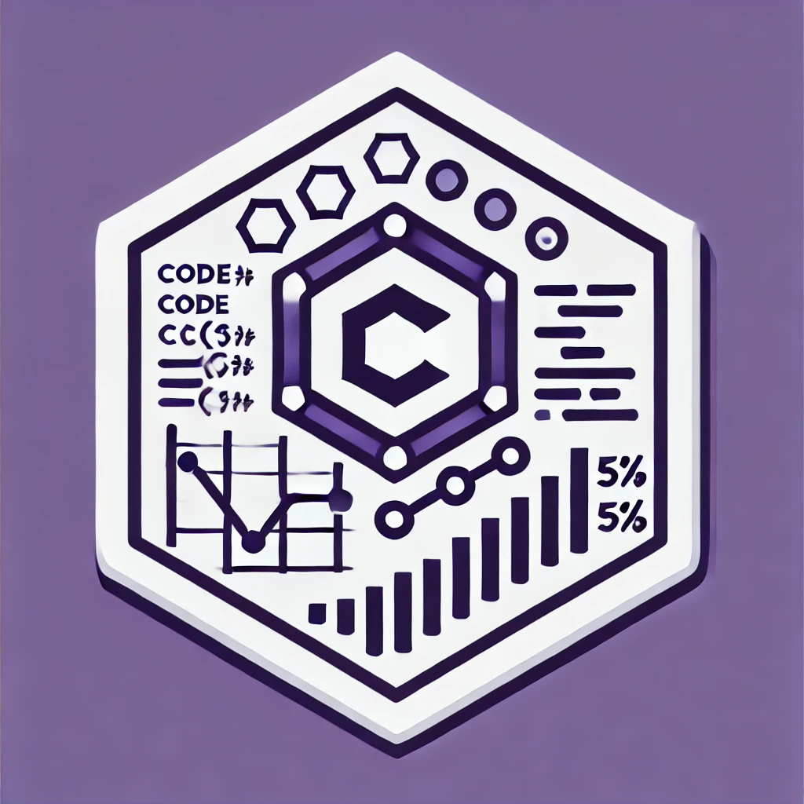

# CodeLineCounter

[](https://github.com/magic5644/CodeLineCounter/actions/workflows/dotnet.yml)
[]([./coverage-report/index.html](https://github.com/magic5644/CodeLineCounter/actions/workflows/dotnet.yml))

<div align="center"></div>

## Description

The `CodeLineCounter` project is a tool that counts the number of lines of code per file, namespace, and project in a .NET solution. It also calculates the cyclomatic complexity of each file.

## Features

- Counts the number of lines of code per file, namespace, and project.
- Calculates the cyclomatic complexity of each file.
- Exports the results to a CSV file.

## Prerequisites

- .NET 8.0 SDK installed.
- The following NuGet packages:
  - `Microsoft.CodeAnalysis.CSharp`
  - `coverlet.collector`
  - `Microsoft.NET.Test.Sdk`
  - `xunit`
  - `xunit.runner.visualstudio`
  - `coverlet.collector`

## Installation

1. Clone the repository:

        ```sh
        git clone https://github.com/magic5644/CodeLineCounter.git
        ```

2. Navigate to the project directory:

        ```sh
        cd CodeLineCounter
        ```

3. Install the necessary NuGet packages:

        ```sh
        dotnet restore
        ```

## Usage

1. Build the project:

        ```sh
        dotnet build
        ```

2. Run the program by providing the directory path containing the solutions to analyze:

        ```sh
        dotnet run --project CodeLineCounter/CodeLineCounter.csproj -d "path/to/directory/with/solutions"
        ```

    or if you want verbose mode on :

        ```sh
        dotnet run --project CodeLineCounter/CodeLineCounter.csproj -verbose -d "path/to/directory/with/solutions"
        ```

3. Select the solution to analyze by entering the corresponding number.

## Generated Files

The program generates a CSV file named `<SolutionName>-CodeMetrics.csv` containing the following metrics:

- `Project`: Project name.
- `ProjectPath`: Relative path of the project.
- `Namespace`: Namespace name.
- `FileName`: File name.
- `FilePath`: Relative path of the file.
- `LineCount`: Number of lines of code.
- `CyclomaticComplexity`: Cyclomatic complexity of the file.
- `CodeDuplications` : Number of code duplications in the file.

## Example Output

    ```csv
    Project,ProjectPath,Namespace,FileName,FilePath,LineCount,CyclomaticComplexity,CodeDuplications
    CodeLineCounter,CodeLineCounter\CodeLineCounter.csproj,CodeLineCounter,Program.cs,CodeLineCounter\Program.cs,64,7,0
    CodeLineCounter,CodeLineCounter\CodeLineCounter.csproj,CodeLineCounter.Models,NamespaceMetrics.cs,CodeLineCounter\Models\NamespaceMetrics.cs,13,1,0
    CodeLineCounter,CodeLineCounter\CodeLineCounter.csproj,NamespaceMetrics,CodeAnalyzer.cs,CodeLineCounter\Services\CodeAnalyzer.cs,109,9,0
    CodeLineCounter,CodeLineCounter\CodeLineCounter.csproj,CodeLineCounter.Services,CodeDuplicationChecker.cs,CodeLineCounter\Services\CodeDuplicationChecker.cs,103,8,6
    CodeLineCounter,CodeLineCounter\CodeLineCounter.csproj,CodeLineCounter.Services,CyclomaticComplexityCalculator.cs,CodeLineCounter\Services\CyclomaticComplexityCalculator.cs,65,12,0
    CodeLineCounter,CodeLineCounter\CodeLineCounter.csproj,CodeLineCounter.Utils,CoreUtils.cs,CodeLineCounter\Utils\CoreUtils.cs,60,7,0
    CodeLineCounter,CodeLineCounter\CodeLineCounter.csproj,CodeLineCounter.Utils,CsvExporter.cs,CodeLineCounter\Utils\CsvExporter.cs,96,12,2
    CodeLineCounter,CodeLineCounter\CodeLineCounter.csproj,CodeLineCounter.Utils,FileUtils.cs,CodeLineCounter\Utils\FileUtils.cs,33,3,0
    CodeLineCounter,CodeLineCounter\CodeLineCounter.csproj,CodeLineCounter.Utils,HashUtils.cs,CodeLineCounter\Utils\HashUtils.cs,25,3,0
    CodeLineCounter,CodeLineCounter\CodeLineCounter.csproj,CodeLineCounter,Total,E:\_GITHUB\NBLignesCount\CodeLineCounter,64,0,0
    CodeLineCounter,CodeLineCounter\CodeLineCounter.csproj,CodeLineCounter.Models,Total,E:\_GITHUB\NBLignesCount\CodeLineCounter,13,0,0
    CodeLineCounter,CodeLineCounter\CodeLineCounter.csproj,CodeLineCounter.Services,Total,E:\_GITHUB\NBLignesCount\CodeLineCounter,65,0,0
    CodeLineCounter,CodeLineCounter\CodeLineCounter.csproj,NamespaceMetrics,Total,E:\_GITHUB\NBLignesCount\CodeLineCounter,109,0,0
    CodeLineCounter,CodeLineCounter\CodeLineCounter.csproj,CodeLineCounter.Utils,Total,E:\_GITHUB\NBLignesCount\CodeLineCounter,25,0,0
    CodeLineCounter,Total,,,,568,,
    CodeLineCounter.Tests,CodeLineCounter.Tests\CodeLineCounter.Tests.csproj,CodeLineCounter.Tests,CodeAnalyzerTests.cs,CodeLineCounter.Tests\CodeAnalyzerTests.cs,68,1,0
    CodeLineCounter.Tests,CodeLineCounter.Tests\CodeLineCounter.Tests.csproj,CodeLineCounter.Tests,CodeDuplicationCheckerTests.cs,CodeLineCounter.Tests\CodeDuplicationCheckerTests.cs,109,1,0
    CodeLineCounter.Tests,CodeLineCounter.Tests\CodeLineCounter.Tests.csproj,CodeLineCounter.Utils.Tests,CoreUtilsTest.cs,CodeLineCounter.Tests\CoreUtilsTest.cs,86,1,0
    CodeLineCounter.Tests,CodeLineCounter.Tests\CodeLineCounter.Tests.csproj,CodeLineCounter.Tests,CsvExporterTest.cs,CodeLineCounter.Tests\CsvExporterTest.cs,35,1,0
    CodeLineCounter.Tests,CodeLineCounter.Tests\CodeLineCounter.Tests.csproj,CodeLineCounter.Tests,CyclomaticComplexityCalculatorTests.cs,CodeLineCounter.Tests\CyclomaticComplexityCalculatorTests.cs,54,1,0
    CodeLineCounter.Tests,CodeLineCounter.Tests\CodeLineCounter.Tests.csproj,CodeLineCounter.Utils.Tests,FileUtilsTest.cs,CodeLineCounter.Tests\FileUtilsTest.cs,18,1,0
    CodeLineCounter.Tests,CodeLineCounter.Tests\CodeLineCounter.Tests.csproj,CodeLineCounter.Tests,Total,E:\_GITHUB\NBLignesCount\CodeLineCounter.Tests,54,0,0
    CodeLineCounter.Tests,CodeLineCounter.Tests\CodeLineCounter.Tests.csproj,CodeLineCounter.Utils.Tests,Total,E:\_GITHUB\NBLignesCount\CodeLineCounter.Tests,18,0,0
    CodeLineCounter.Tests,Total,,,,370,,
    Total,,,,,938,
    ```
The program generates a CSV file named `<SolutionName>-CodeDuplication.csv` in the current directory containing the following metrics:

- `Code Hash`: Hash of the duplicate code.
- `FilePath`: Full path of the file.
- `MethodName`: Name of the method.
- `StartLine`: Start line of the duplicate code.

## Example Output of CodeDuplication.csv

    ```csv
    Code Hash,FilePath,MethodName,StartLine
    0133e750c0fec3d478670cb0441882855926c415a35aacf0360508fdeb73c34c,C:\temp\NamespaceMetrics.cs,CodeLineCounter\Models\class.cs,EtablirCommunication,91
    ```   

## Project Structure

    ```bash
    NBLignesCount/
    │
    ├── CodeLineCounter/
    │   ├── Models/
    │   │   └── NamespaceMetrics.cs
    │   ├── Services/
    │   │   ├── CodeAnalyzer.cs
    │   │   ├── CodeDuplicationChecker.cs
    │   │   └── CyclomaticComplexityCalculator.cs
    │   ├── Utils/
    │   │   ├── CoreUtils.cs
    │   │   │── CsvExporter.cs
    │   │   │── FileUtils.cs
    │   │   └── HashUtils.cs
    │   ├── Program.cs
    │   └── CodeLineCounter.csproj
    ├── CodeLineCounter.Tests/
    │   ├── CodeAnalyzerTests.cs
    │   ├── CodeDuplicationCheckerTests.cs
    │   ├── CyclomaticComplexityCalculatorTests.cs
    │   ├── CoreUtilsTest.cs
    │   ├── CsvExporterTest.cs
    │   ├── FileUtilsTest.cs
    │   └── CodeLineCounter.Tests.csproj
    ├── .gitignore
    ├── README.md
    ├── LICENSE
    └── CodeLineCounter.sln
    ```

## Unit Tests

To run the unit tests, use the following command:

    ```sh
    dotnet test
    ```

To generate code coverage, use the following command:

    ```sh
    dotnet test --collect:"XPlat Code Coverage;Format=json,lcov,cobertura"  --results-directory CodeLineCounter.Tests\TestResults
    ```

Or use generate-covertura.sh to generate code coverage.

    ```sh
    generate-covertura.sh
    ```

Or generate-covertura.cmd for Windows

    ```cmd
    generate-covertura.cmd
    ```

## Publishing

To publish the project, use the following command:

    ```sh
    dotnet publish -c Release -o publish -a x64 --sc true /p:PublishSingleFile=true /p:IncludeNativeLibrariesForSelfExtract=true /p UseAppHost=true
    ```

## Contributing

Contributions are welcome! Please open an issue or a pull request for any suggestions or improvements.

## 💪 Thanks To All Contributors

<a href="https://github.com/magic5644/codelinecounter/graphs/contributors">
  
</a>

## License

This project is licensed under the MIT License. See the [LICENSE](LICENSE) file for more details.
